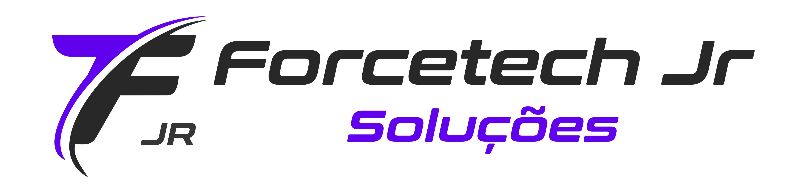

# Trabalho de Programação Web I utilizando Bootstrap
#### Página institucional da Forcetech Jr, empresa Júnior do IFPR campus União da Vitória.

# Membros
Liste os alunos que fazem parte do grupo.
* *Kayane Blodorn Alebrante*
* *Lee Eros Galaad Dias de Moura*

## Referências

 - [Awesome Readme Templates](https://awesomeopensource.com/project/elangosundar/awesome-README-templates)
 - [Html](https://awesomeopensource.com/project/elangosundar/awesome-README-templates)
 - [CSS](https://developer.mozilla.org/pt-BR/docs/Web/CSS)
 - [Bootstrap](https://getbootstrap.com/docs/5.3/getting-started/introduction/)
